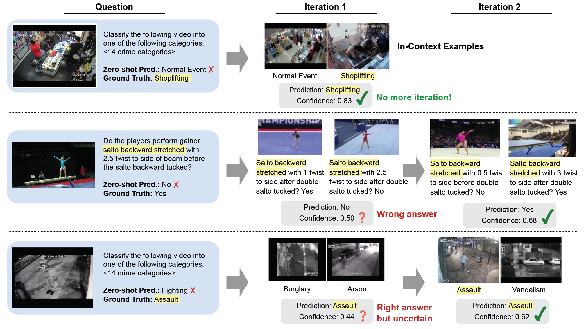
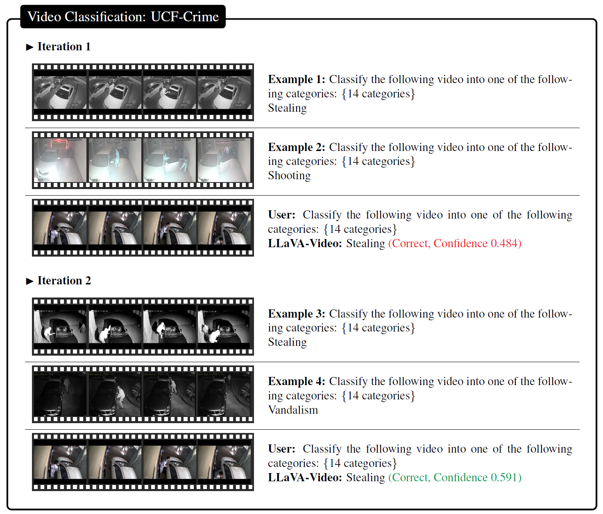
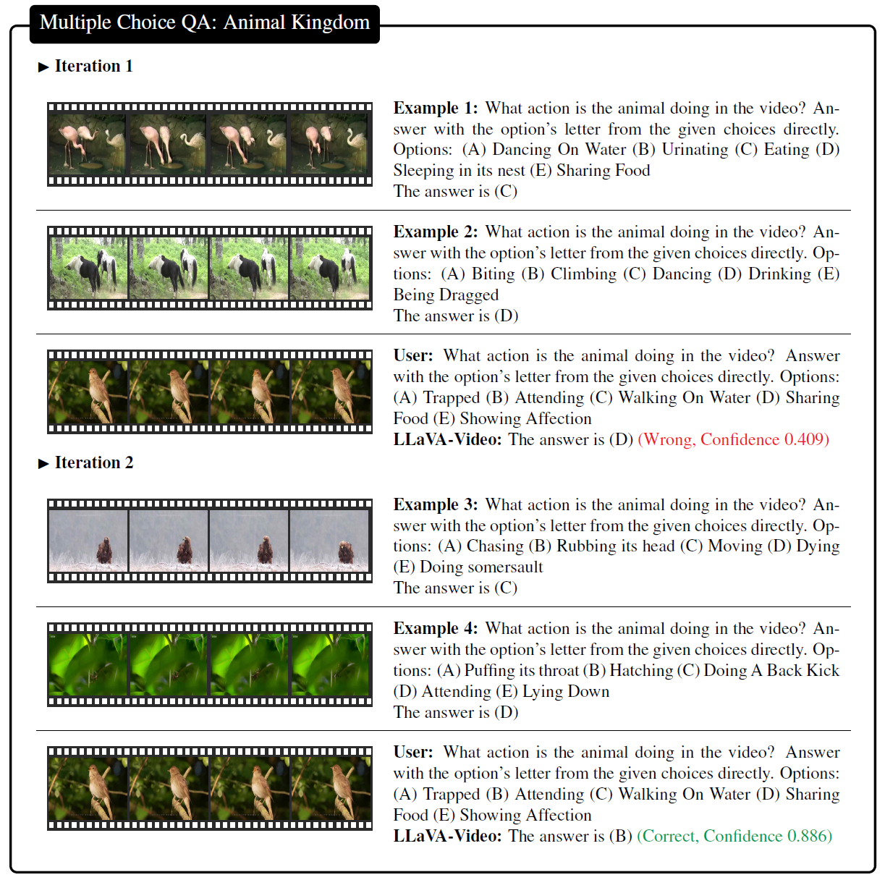
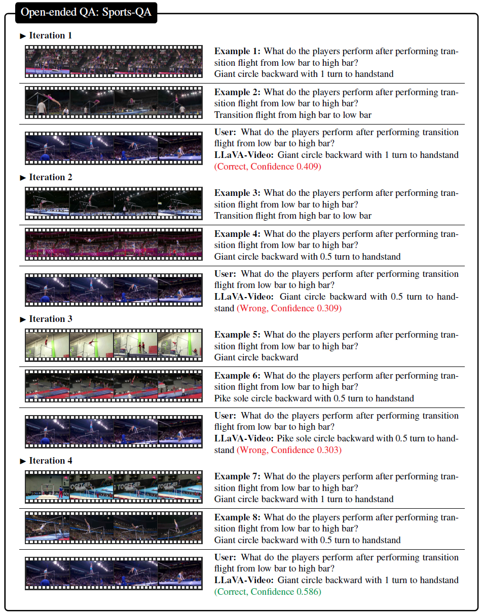

# VideoICL: Confidence-based Iterative In-context Learning for Out-of-Distribution Video Understanding
[](https://arxiv.org/abs/2412.02186)
[](https://www.python.org/downloads/release/python-310s0/)
[](https://gcc.gnu.org/gcc-9/)

🚀 **Welcome to the official repository of** [**VideoICL: Confidence-based Iterative In-context Learning for Out-of-Distribution Video Understanding**](https://arxiv.org/abs/2412.02186)!

## 🔍 What is VideoICL?


Applying in-context learning to video-language tasks faces challenges due to the limited context length in video LMMs, as videos require longer token lengths. To address these issues, we propose **VideoICL, a novel video in-context learning framework for OOD video understanding tasks** that extends effective context length without incurring high costs.

Our VideoICL implementation includes the following key features:
* ✅ **Similarity-based Example Selection:** Selects relevant video-question pairs based on query relevance.
* 🔁 **Confidence-based Iterative Inference:** Iteratively refining the results until a high-confidence response is obtained.
* 🏆 **State-of-the-Art Performance:** Outperforms existing baselines including GPT-4o and Gemini on multiple benchmarks with 7B model.

## 📌 Get Started

In this repository, we evaluate Qwen2-VL-7B model using VideoICL on a video classification task using the [UCF-Crime](https://www.crcv.ucf.edu/projects/real-world/) dataset.

### Installation
```bash
conda create -n videoicl python=3.10 -y
conda activate videoicl
git clone https://github.com/KangsanKim07/VideoICL.git
cd VideoICL
```

### Dataset preparation
Download following files to `data/UCF-Crime/raw` folder from [this link](https://www.dropbox.com/scl/fo/2aczdnx37hxvcfdo4rq4q/AOjRokSTaiKxXmgUyqdcI6k?rlkey=5bg7mxxbq46t7aujfch46dlvz&e=1&dl=0).
- Anomaly-Videos-Part-1~4.zip
- Normal_Videos_for_Event_Recognition.zip
- UCF-Crimes-Train-Test-Split.zip

And run
```bash
sh data/UCF-Crimes/preprocess.sh
```
After running preprocessinng, `data` folder should be like this.
```
data
└── UCF-Crimes
    ├── raw
    │    ├── Anomaly-Videos-Part-*.zip
    │    ├── Normal_Videos_for_Event_Recognition.zip
    │    ├── UCF-Crimes-Train-Test-Split.zip
    │    └── ...
    ├── videos
    │    ├── Normal_Videos_event
    │    ├── Abuse
    │    ├── Arrest
    │    ├── ...
    │    └── Vandalism
    └── Action_Recognition_splits
        ├── test_001.txt
        ├── test_002.txt
        ├── ...
        ├── train_003.txt
        └── train_004.txt
```


### Video feature extraction
Download [InternVideo2 checkpoint](https://huggingface.co/OpenGVLab/InternVideo2-Stage2_1B-224p-f4).

And run
```bash
sh scripts/extract_visual_feat.sh ${PATH_TO_InternVideo2-stage2_1b-224p-f4.pt}
```
It will generate a file of video features as `data/UCF-Crimes/vid_feat.pkl`.

### Get similarity rank
```bash
sh sctipts/get_simrank.sh
```
It will generate similarity rankings for each test video in `data/UCF-Crimes/simrank`.

### Inference with VideoICL
```bash
pip install qwen-vl-utils
sh scripts/run_videoicl.sh
```

## 💯 Results
### Performance

| **Model**      | **#example** | **Animal Kingdom** | **Sports-QA** | **Pit-VQA** | **UCF-Crime** | **Drive& Act** | **CapERA** |
|:---------------|:------------:|:------------------:|:-------------:|:-----------:|:-------------:|:-------------:|:----------:|
| GPT-4o         |   0   |       58.2         |       -       |     6.9     |     58.0      |       -       |   0.173    |
| Gemini-1.5 Pro |   0   |       72.9         |       -       |    14.7     |     55.1      |       -       |   0.176    |
|LLaVA-Video-72B |   0   |       69.7         |      25.7     |    5.7      |     35.6      |     14.6      |   0.170    |
|LLaVA-Video-7B  |   0   |       68.0         |      25.5     |    6.7      |     39.3      |     20.2      |   0.181    |
| **<ins>+VideoICL</ins>**|**<ins>8</ins>**|**<ins>72.3</ins>**|**<ins>47.6</ins>**|**<ins>61.3</ins>**|**<ins>53.3</ins>**|**<ins>53.4</ins>**|**<ins>0.178</ins>**|
|Qwen2-VL-7B     |   0   |       58.6         |      26.8     |    5.8      |     36.1      |     10.6      |   0.138    |
|**<ins>+VideoICL</ins>**|**<ins>8</ins>**|**<ins>66.3</ins>**|**<ins>51.5</ins>**|**<ins>59.6</ins>**|**<ins>48.7</ins>**|**<ins>49.3</ins>**|**<ins>0.189</ins>**|
|Oryx-1.5-7B     |   0   |     58.6       |      28.3     |    3.8      |     11.9      |     10.7      |   0.151    |
|**<ins>+VideoICL</ins>**|**<ins>8</ins>**|**<ins>58.5</ins>**|**<ins>52.0</ins>**|**<ins>58.4</ins>**|**<ins>44.0</ins>**|**<ins>57.3</ins>**|**<ins>0.179</ins>**|


### Qualitative results

<!--  -->
<!--  -->
<!--  -->

## 📜 Citation

If you find this work useful, please cite our paper:
```bibtex
@article{kim2024videoicl,
  title={VideoICL: Confidence-based Iterative In-context Learning for Out-of-Distribution Video Understanding},
  author={Kim, Kangsan and Park, Geon and Lee, Youngwan and Yeo, Woongyeong and Hwang, Sung Ju},
  journal={arXiv preprint arXiv:2412.02186},
  year={2024}
}
```